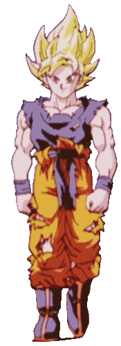

<!-- Presentation Section -->

  <a href="https://git.io/typing-svg">
  <h1>Hey , I'm Brian</h1>

<!-- About Section -->
I am currently a student of Computer Engineering 💻 at the Universidad Autónoma Metropolitana in Mexico City. I like to learn new things and do projects in my free time 🤔, my favorite programming language is Python 🐍 and I am of the idea that NeoVim will conquer the world as the best and unique text editor 👑.
 
 
  
<!-- More About Me section -->
## > <code>⠀⠀🧐 More about me⠀⠀</code> 

  
* 👨‍💻 I like to solve programming problems.
* 👨‍🏫 I like algorithms and data structures.
* 🍜 I like anime.
* 🏃‍♂️ I like sports.
* 👾 I like video games.
* ⚽ I am a fan of FC Barcelona.
* 🏎 I am a Checo Lover.
* 📓 My favorite text editor is NeoVim.
 
 
  
<!-- Languages and Technologies -->
## > <code>⠀⠀💻 Programming languages and technologies I have used⠀⠀</code>  

  
  <a href="https://en.wikipedia.org/wiki/C_(programming_language)" title="C">
  <a href="https://www.php.net/" title="PHP">
  
  
  
  
  
  
  

 
 
  
<!-- Activity -->
## > <code>⠀⠀💼 Activity⠀⠀</code> 

𝘈𝘤𝘵𝘪𝘷𝘪𝘵𝘺 𝘎𝘳𝘢𝘱𝘩 𝘱𝘳𝘰𝘷𝘪𝘥𝘦𝘥 𝘣𝘺 [𝘈𝘴𝘩𝘶𝘵𝘰𝘴𝘩 𝘋𝘸𝘪𝘷𝘦𝘥𝘪](https://github.com/Ashutosh00710/github-readme-activity-graph).
